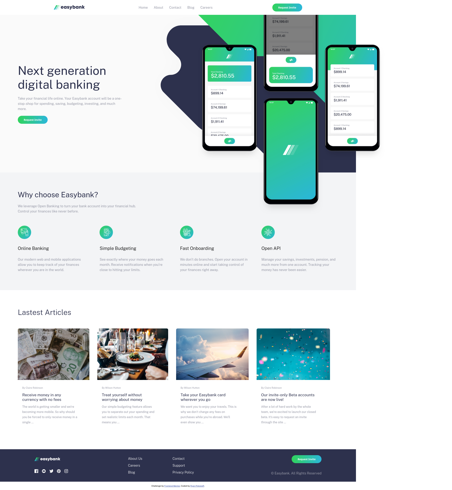
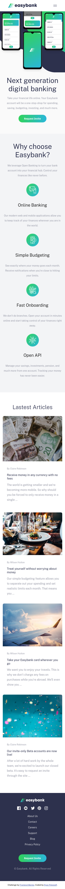

# Frontend Mentor - Easybank landing page solution

This is a solution to the [Easybank landing page challenge on Frontend Mentor](https://www.frontendmentor.io/challenges/easybank-landing-page-WaUhkoDN). Frontend Mentor challenges help you improve your coding skills by building realistic projects. 

## Table of contents

- [Overview](#overview)
  - [The challenge](#the-challenge)
  - [Screenshot](#screenshot)
  - [Links](#links)
- [My process](#my-process)
  - [Built with](#built-with)
  - [What I learned](#what-i-learned)
  - [Continued development](#continued-development)
- [Author](#author)


## Overview
Built using Semantic HTML5, CSS, and javascript.  I built this app as close to the desktop and mobile design pictures provided in the design file.


### The challenge

Users should be able to:

- View the optimal layout for the site depending on their device's screen size
- See hover states for all interactive elements on the page

### Screenshot
Desktop: 



Mobile:




### Links

- Solution URL: [Solution](https://github.com/rdpinkst/easybank-landing-page-master)
- Live Site URL: [Live Solution](https://rdpinkst.github.io/easybank-landing-page-master/)

## My process
Building this project, writing the Semantic HTML5 markup.  Once the basic structure was built I started styling the page and adding divs where it was needed to achieve the style seen in the design files.  With the full screen site designed, I started designing the mobile app with a media query.  The navbar needed some javascript event listeners to close and open the nav links from the hamburger icon.  The final design for both the mobile and desktop app where then complete.

### Built with

- Semantic HTML5 markup
- Flexbox
- CSS Grid

**Note: These are just examples. Delete this note and replace the list above with your own choices**

### What I learned

Building this app I learned that the img tag could not be used with svg, if you wanted to have a hover effect.  To solve this problem spans were used, with a mask-image set to the url where the img is in the project.  A background color, height, and width were then needed to show the image.  A hover effect was then needed to change the background of the svg.  

To see how you can add code snippets, see below:

```html
     <span class="logo-span facebook"></span>

```
```css
.logo-span {
    width: 20px;
    height: 20px;
    background-color: hsl(0, 0%, 98%);
    cursor: pointer;
    margin-right: 1rem;
}
.facebook {
    mask-image: url(./images/icon-facebook.svg);
}
.logo-span:hover  {
    background-color: hsl(136, 65%, 51%);    
}
```

### Continued development

I need to working on making the app more responsive.  I designed it to look like the desktop and mobile design, but all the different size screens inbetween won't look to good.  Also in the future I could make this a react app and practice my react skills.

## Author

- Frontend Mentor - [@rdpinkst](https://www.frontendmentor.io/profile/rdpinkst)
